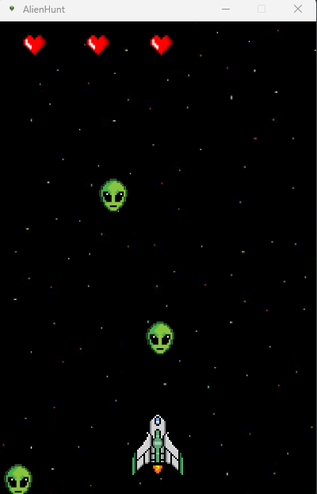

# AlienHunt

## Description
AlienHunt is an engaging arcade-style game developed using the Pygame library in Python. Immerse yourself in a thrilling adventure where you control a spaceship, tasked with defending the Earth from relentless waves of alien invaders. With intuitive controls and vibrant graphics, AlienHunt promises hours of entertainment for players of all ages.




## Features
- **Intuitive Controls:** Seamlessly navigate the spaceship using the left and right arrow keys.
- **Immersive Gameplay:** Engage in fast-paced action as you shoot down incoming alien attackers.
- **Health Indicator:** Monitor your spaceship's health with a visual indicator displayed on the screen.
- **Score Tracking:** Keep track of your performance with a real-time score counter.
- **Dynamic Difficulty:** Experience escalating challenges with the respawn of aliens at regular intervals.
- **Game Over Screen:** Receive immediate feedback on your performance with a dedicated game over screen upon losing all health.

## Installation
1. **Python Installation:** Ensure you have Python installed on your system. If not, download and install Python from [here](https://www.python.org/downloads/).
2. **Clone Repository:** Clone or download the AlienHunt repository to your local machine.
3. **Install Dependencies:** Open a terminal window and navigate to the directory containing the game files. Install the required dependencies using pip:
    ```
    pip install pygame
    ```
4. **Launch Game:** Execute the `main.py` file to start the game:
    ```
    python main.py
    ```

## Controls
- **Left Arrow Key:** Move the spaceship to the left.
- **Right Arrow Key:** Move the spaceship to the right.
- **Space Bar:** Shoot bullets to eliminate alien threats.

## Dependencies
- Pygame

## Acknowledgments
- This game was developed as a personal project to explore game development with Pygame.
- Special thanks to the Pygame community for providing valuable tutorials, documentation, and resources.


## About the Developer
AlienHunt was created by Houmine Rayyane. For feedback, feel free to contact houmrayyane@gmail.com.